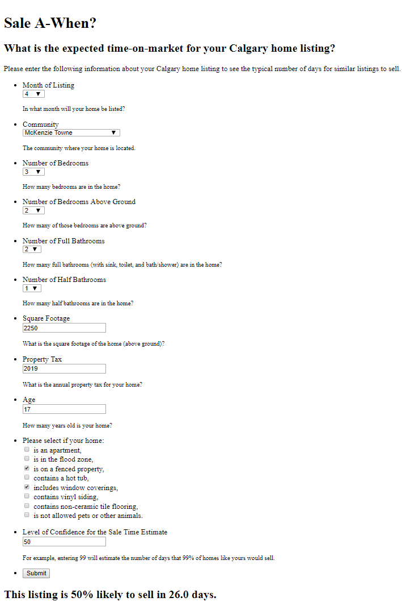

# Sale A-When?
## Predicting the time to sell your home in the Calgary, Alberta, Canada market. Receive data-based forecasts of days-on-market for your Calgary listing at <a href="http://saleawhen.site/">http://saleawhen.site/</a>

This is the source code for a webapp created as an <a href="http://www.insightdatascience.com/">Insight Data Science Fellow</a>. This was part of a consulting project for a Canadian real-estate startup company that was interested in creating a model that can predict how long a listed house will take to sell. They provided a proprietary data set of over 50 000 sold homes since 2010, including detailed information about each property and their neighborhoods, which resulted in the predictive model used by Sale A-When.

The webapp is a webform that queries the user for relevant details about their listing and the confidence percentage level desired for the days-on-market. For example, selecting a confidence level of 99 would result in an output representing the number of days required for 99% of similar listings to sell.

## Motivation
An accurate prediction of the number of days expected for a home to sell is valuable information for anyone planning to sell their home. It helps with making appropriate moving plans, and with determining the appropriate time to put the property on the market.

This information is also important to property investors who need to understand the liquidity of their assets. Home flippers who buy properties to upgrade and re-sell them at a profit need to estimate how much holding costs will eat into their profit margins, such as mortgage interest, property insurance, and maintenance.

Sale A-When provides information about how different upgrades to a property could impact the days-on-market. Information about the full days-on-market distribution is provided so that sellers can make appropriate contingency plans for every eventuality.

## Screenshot

## Tech/framework used

<b>Built with</b>
- [Python](https://www.python.org/)
- [Flask](https://flask.pocoo.org/)

## License
GNU General Public License v3

GNU © [Sheldon Campbell](https://www.github.com/shscampbell/)